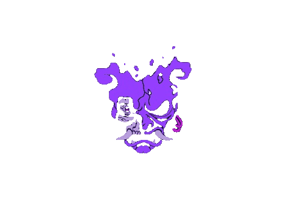

  

<ul>
  <li>🧑‍💻 I'm a full-stack developer with a soft spot for React and related technologies, so I lean towards the frontend. </li>
  <li>⚡ Fun fact: Feel free to call me Gabo.</li>
  <li>📫 Get in touch!
      <ul>
        <li>My <a href="mailto:gabriel.nunez.arenas@gmail.com">email</a></li>
        <li>My <a href="https://www.linkedin.com/feed/">linkedin</a></li>
      </ul>
  </li>
</ul>

 
 
 

