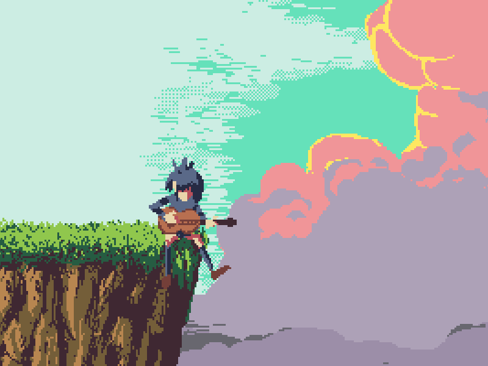

  <table>
    <tr>
      <td>
        

          
        

        

          
        

      </td>
      <td>
        
        <ul>
          <li>🧑‍💻 I'm a software developer with a soft spot for React and related technologies, so I lean towards the frontend. </li>
          <li>⚡ Fun fact: Feel free to call me Gabo.</li>
          <li>📫 Get in touch!
              <ul>
                <li>My <a href="mailto:gabriel.nunez.arenas@gmail.com">email</a></li>
                <li>My <a href="https://www.linkedin.com/feed/">linkedin</a></li>
              </ul>
          </li>
        </ul>
      </td>
    </tr>
  </table>

  <table>
    <tr>
      <td>
        
         
        
      </td>
      <td>
        
         
        
      </td>
    </tr>
  </table>

